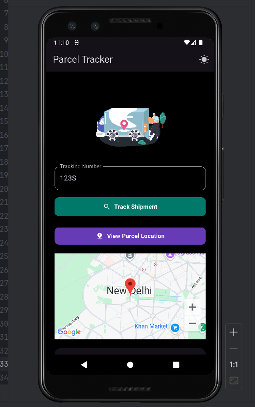
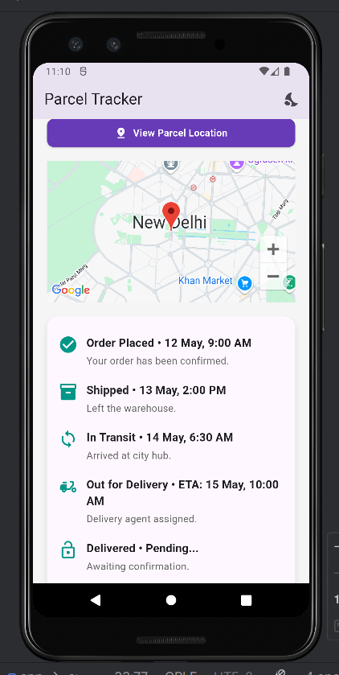

# parcel_trackerapp

A new Flutter project.

## Getting Started

# 📦 Parcel Tracker App – Flutter

A visually appealing and responsive mobile application built using **Flutter**. This app allows users to track their parcel delivery in real-time using a demo tracking ID. It features step-based delivery progress, Google Maps integration for live location visualization, and a smooth, intuitive UI. The interface supports both dark and light themes and is ideal for showcasing delivery stages from dispatch to arrival in a clean and interactive format.

---

## 📱 Screenshots

### 🌗 Home Screen (Dark Mode)


### 🗺️ Tracking Screen with Map


---

## 🚀 Features
- Real-time parcel tracking (simulated)
- Delivery status updates with icons and timestamps
- Google Maps integration
- Light and dark theme toggle
- Animated delivery intro (Lottie)
- Flutter + Dart, responsive across devices

---

## 🧪 Technologies Used
- Flutter & Dart
- Google Maps SDK for Android
- Lottie Animations
- Permission Handler
- State Management with StatefulWidgets

---

## 📂 How to Run
```bash
flutter pub get
flutter run

